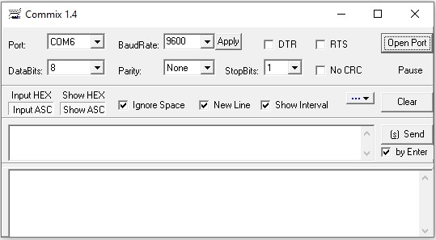

<h2>Commix serielles Debugging-Tool</h2>

 Das größte Merkmal dieser Software ist, dass sie automatisch eine Modbus-CRC-Prüfung hinzufügen kann, was sehr praktisch für das Senden von Modbus-RTU-Befehlen ist.