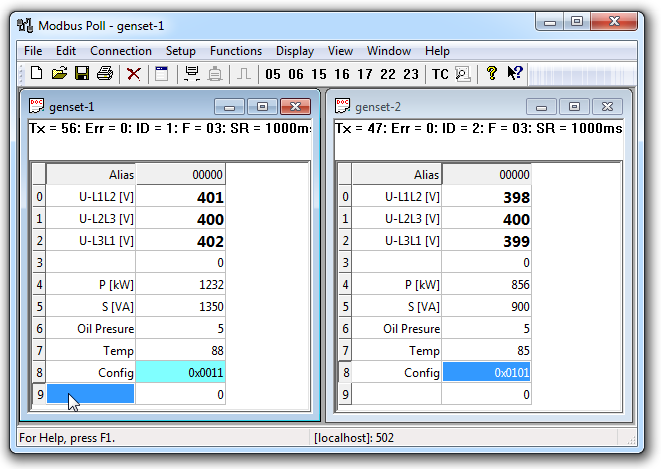

Diese Software wurde aus der CN-Version übernommen!

<h2>Modbus Poll</h2>

Modbus Poll ist ein Modbus-Master-Simulator, der in erster Linie Entwicklern von Modbus-Slave-Geräten oder anderen, die das Modbus-Protokoll testen und simulieren wollen, helfen soll. Mit der Schnittstelle für mehrere Dokumente können Sie mehrere Modbus-Slaves und/oder Datenbereiche gleichzeitig überwachen. Für jedes Fenster geben Sie einfach die Modbus-Slave-ID, Funktion, Adresse, Größe und Poll-Rate an. Sie können von jedem Fenster aus Register und Coils lesen und schreiben. Wenn Sie ein einzelnes Register ändern wollen, doppelklicken Sie einfach auf den Wert. Oder Sie können mehrere Register/Spulen ändern. Mehrere Datenformate wie Float, Double und Long mit Word Order Swapping sind verfügbar.

Ausnahmefehler werden in der Statuszeile angezeigt.

Wenn Sie ein Slave-Entwickler sind, können Sie Ihre eigenen Teststrings im "Testcenter" zusammenstellen und senden und das Ergebnis vom Slave in Hex-Zahlen überprüfen.

OLE Automation für die Anbindung an Excel. Zur Interpretation und Darstellung der Modbus-Daten gemäß Ihren spezifischen Anforderungen. Bearbeiten Sie z.B. Daten in Excel und übertragen Sie die Daten dann an Ihr Slave-Gerät! Testen Sie das Excel-Beispiel.xlsm, das mit dem Programm installiert wird.

<b>Unterstützte Protokollvarianten:</b>
- Modbus RTU
- Modbus ASCII
- Modbus TCP/IP
- Modbus RTU über TCP/IP
- Modbus ASCII Over TCP/IP
- Modbus UDP/IP
- Modbus RTU über UDP/IP
- Modbus ASCII Over UDP/IP

<b>MODBUS Poll Technische Fakten und Eigenschaften:</b>
- OLE-Automatisierung für eine einfache Schnittstelle zu Excel mit der Makrosprache VBA
- Lesen/Schreiben von bis zu 125 Registern
- Lesen/Schreiben von bis zu 2000 Eingängen/Spulen
- Test Center (Stellen Sie Ihre eigenen Teststrings zusammen)
- Drucken und Druckvorschau
- Überwachung des seriellen Datenverkehrs
- Datenprotokollierung in Textdatei
- Datenprotokollierung direkt in Excel
- Kontextsensitive Hilfe
- 28 Anzeigeformate wie Float, Double usw.
- Einstellbare Adressbasis (0 oder 1)
- Schriftart und Auswahl
- Bedingte Farbauswahl
- Skalierung
- Übertragung (Slave-ID 0)
- Einfache Steuerung von RS-485-Wandlern mit RTS-Umschaltung
- ENRON/DANIEL-Modus
- 6-stellige Adressen
- Echtzeit Charting

<b>Unterstützte Modbus-Funktionen:</b>
- 01: Spulenstatus lesen
- 02: Lesen des Eingangsstatus
- 03: Halteregister lesen
- 04: Lesen von Eingangsregistern
- 05: Einzelne Spule schreiben
- 06: Einzelne Register schreiben
- 15: Mehrere Spulen schreiben
- 16: Schreiben von mehreren Registern
- 17: Server-ID melden
- 22: Register schreiben maskieren
- 23: Lesen/Schreiben von Registern
- 43/14: Gerätekennung lesen

Die Schnellstart-Anleitung gibt es hier: https://www.modbustools.com/quickstart.html
Das komplette User-Manual gibt es hier: https://www.modbustools.com/mbpoll-user-manual.html