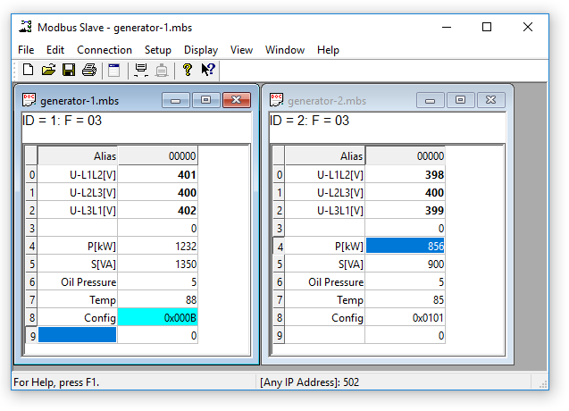

Diese Software wurde aus der CN-Version übernommen!

<h2>Modbus Slave</h2>

Modbus Slave ist für die Simulation von bis zu 32 Slave-Geräten in 32 Fenstern! Beschleunigen Sie Ihre SPS-Programmierung mit diesem Simulationswerkzeug. Beginnen Sie mit der Programmierung und testen Sie, bevor Sie Ihr Slave-Gerät vom Lieferanten erhalten. Die Daten, die in jedem geöffneten Dokument enthalten sind, sind für die Master-Anwendung zugänglich. Gleiche Benutzeroberfläche wie Modbus Poll. Unterstützt die Funktionen 01, 02, 03, 04, 05, 06, 15, 16, 22 und 23.
Überwachung des seriellen Datenverkehrs. OLE Automation für die Verbindung mit Visual Basic, Excel usw. Interpretation und Darstellung der Modbus-Daten nach Ihren spezifischen Anforderungen. Bearbeiten Sie z.B. Ihre Slave-Daten in Excel. Probieren Sie die im Programm enthaltene Excel example.xls aus.
Jedes Fenster, das innerhalb von Modbus Slave geöffnet wird, kann so konfiguriert werden, dass es Daten desselben oder anderer Slave-Knoten darstellt.

OLE Automation für die Verbindung mit Excel. Zur Interpretation und Darstellung der Modbus-Daten gemäß Ihren spezifischen Anforderungen. Bearbeiten Sie z.B. Daten in Excel und übertragen Sie die Daten dann an Ihr Slave-Gerät! Probieren Sie das Excel-Beispiel.xlsm aus, das mit dem Programm installiert wird.

<b>Unterstützte Protokollvarianten:</b>
- Modbus RTU
- Modbus ASCII
- Modbus TCP/IP
- Modbus RTU über TCP/IP
- Modbus UDP/IP
- Modbus RTU über UDP/IP

<b>MODBUS Slave Technische Fakten und Eigenschaften:</b>
- OLE Automation für eine einfache Schnittstelle zu Excel mit der Makrosprache VBA
- Drucken und Druckvorschau
- Überwachung des seriellen Datenverkehrs
- Kontextsensitive Hilfe
- 12 Anzeigeformate wie Float, Double etc.
- Einstellbare Adressbasis (0 oder 1)
- Schriftart und Farbauswahl
- Rundsenden (Slave-ID 0)
- Einfache Steuerung von RS-485-Wandlern mit RTS-Umschaltung

<b>Unterstützte Modbus-Funktionen:</b>
- 01: Spulenstatus lesen
- 02: Lesen des Eingangsstatus
- 03: Halteregister lesen
- 04: Lesen von Eingangsregistern
- 05: Einzelne Spule schreiben
- 06: Einzelne Register schreiben
- 15: Mehrere Spulen schreiben
- 16: Schreiben von mehreren Registern
- 22: Register schreiben maskieren
- 23: Lesen/Schreiben von Registern

Das komplette User-Manual gibt es hier: https://www.modbustools.com/mbslave-user-manual.html