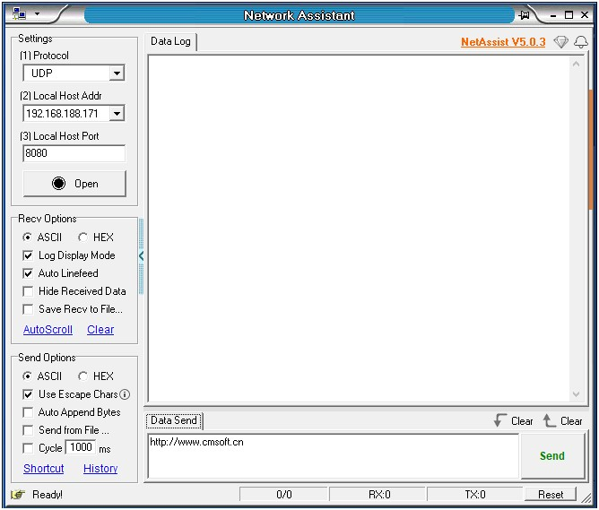

<h2>Network Assistant</h2>

NetAssist Network Debugging Assistant ist ein TCP/IP-Netzwerk-Debugging-Tool, das unter der Windows-Plattform entwickelt wurde. Es integriert TCP/UDP-Server und -Client. Es ist eines der notwendigen professionellen Tools für die Entwicklung und das Debugging von Netzwerkanwendungen. Es kann Entwicklern beim Design von Netzwerkanwendungen helfen und Tester überprüfen den Datensende- und -empfangsstatus der entwickelten Netzwerkanwendungssoftware/-hardware, verbessern die Entwicklungsgeschwindigkeit, vereinfachen die Entwicklungskomplexität und werden zu einem leistungsstarken Assistenten für TCP/UDP-Anwendungsentwicklung und -debugging. NetAssist Network Debugging Assistant ist eine umweltfreundliche Software, die keine Installation und nur eine ausführbare Datei erfordert, auf allen Versionen von Windows-Betriebssystemen anwendbar ist und keine Unterstützung des Microsoft dotNet-Frameworks benötigt. Es kann als Client oder Server verwendet werden: Auf einem PC können mehrere Netzwerk-Debugging-Assistenten gleichzeitig gestartet werden, von denen einer als Server und der andere als Client eingestellt und dann der Client betrieben werden kann um sich mit dem geöffneten Server zu verbinden. Solange Protokoll, Adresse und Port richtig eingestellt sind, kann die Verbindung und Kommunikation erfolgreich durchgeführt werden. Typische Anwendungsfälle: Über den Netzwerk-Debugging-Assistenten zur Kommunikation mit dem selbst entwickelten Netzwerkprogramm oder Netzwerkgeräten zum gemeinsamen Debuggen. Die Software unterstützt UDP- und TCP-Protokolle, integriert Server und Client und kann mehrere Client-Verbindungen als Server verwalten; unterstützt Unicast/Broadcast; unterstützt ASCII/Hex zwei Modi für Datenübertragung und -empfang, und die gesendeten und empfangenen Daten können willkürlich sein Konvertierung zwischen Hexadezimal- und ASCII-Codes; Prüfziffern können automatisch gesendet werden, und mehrere Prüfformate werden unterstützt; Skriptcodes können in die gesendeten Daten eingebettet werden, um ein dynamisches Senden von Daten zu realisieren; automatische Antwortregeln können eingerichtet werden, um eine automatische Antwort auf Befehle /Antwort zu realisieren Funktion; unterstützt das Senden von Intervallen, das zyklische Senden, das Senden von Stapeln, Eingabedaten können aus externen Dateien importiert werden; vordefinierte Befehls-/Datensequenzen können gespeichert werden, und vordefinierte Befehle oder Daten können jederzeit über das Tool-Panel gesendet werden, was für die Kommunikation bequem ist Tune. Die Softwareschnittstelle unterstützt Chinesisch/Englisch, und die Sprachumgebung des adaptiven Betriebssystems ist voreingestellt.

<b>Softwarefunktionen</b>
1. Umweltfreundliche Software, nur eine ausführbare Datei, keine Installation erforderlich
2. Unterstützung von zwei Sprachen Chinesisch und Englisch, automatische Auswahl des Systemsprachentyps entsprechend der Betriebssystemumgebung
3. Unterstützung von TCP- und UDP-Protokollen, Unterstützung von Broadcasting , unterstützt TCP-Server, TCP-Client, UDP drei Arbeitsmodi;
4. Unterstützt ASCII/Hex-Übertragung, die gesendeten und empfangenen Daten können zwischen Hexadezimal- und ASCII-Codes konvertiert werden, unterstützt das Senden und Anzeigen chinesischer Schriftzeichen;
5. Kann automatisch Prüfziffern senden, Unterstützung mehrerer Prüfsummenformate wie Prüfsumme, XOR, CRC16, festes Byte usw.
6. Unterstützung des AT-Befehls zum automatischen Hinzufügen der Option Wagenrücklauf und Zeilenvorschub Wenn diese Option aktiviert ist, wird das Ende der Zeile automatisch ausgefüllt beim Senden von AT-Spezifikation Wagenrücklauf und Zeilenvorschub
7. Der Sendeinhalt unterstützt Escape-Zeichen, wenn beispielsweise das Sendefeld Escape-Zeichen wie \r\n enthält, wird es automatisch in den entsprechenden ASCII-Code zum Senden geparst
8 . Unterstützen Sie das dynamische Senden von Skriptcodes, Sie können Skriptcode der Sprache C in die gesendeten Textdaten einbetten, um das dynamische Senden von Daten zu realisieren;
9. Empfangene Daten können automatisch in einer Datei gespeichert werden und unterstützen zwei Optionen für Datendatei und Protokolldatei;
10. Unterstützt Log-Empfangsmodus: automatische Anzeige beim Empfang von Inhalten Zeitstempel und andere zugehörige Informationen
11. Unterstützt das Senden in beliebigen Intervallen, das zyklische Senden
12. Kann Daten aus Dateien zum Senden importieren
13. Empfangen und Senden von Text unterstützt ANSI und UTF8 zwei Codierungsmethoden;
14. Unterstützt vordefinierte/Shortcut-Anweisungen, die über benutzerdefinierte Tastenkombinationen gesendet werden können
15. Unterstützt vordefinierte und gespeicherte Batch-Daten oder Anweisungssequenzen, kann die Sendeverzögerung jeder Anweisung festlegen und Batches nacheinander gemäß der festgelegten Reihenfolge und Verzögerung senden Zeit,
16. Unterstützt die automatische Antwortfunktion, durch die Einrichtung von automatischen Antwortregeln, um eine automatische Befehlsantwort zu erreichen,
17. Speichern Sie automatisch historische Sendeaufzeichnungen, Sie können historische Aufzeichnungen aufrufen, um historische Daten zu senden;
18. Integrierter 808-Protokoll-Client-Simulator des Ministeriums, der die Protokolle JT/T808-2019 und JT/T808-2013 unterstützt
19. Integrierter Modbus-Protokoll-Befehlssimulator, der die drei Protokolle RTU, ASCII, TCP unterstützt
20. Integrierter IEEE754-Gleitkomma-Datenformatkonverter
21. Benutzeroberflächenfensterhintergrund und Schriftartanpassung unterstützen 
22. Der Standardinhalt des Sendefelds
kann angepasst werden.