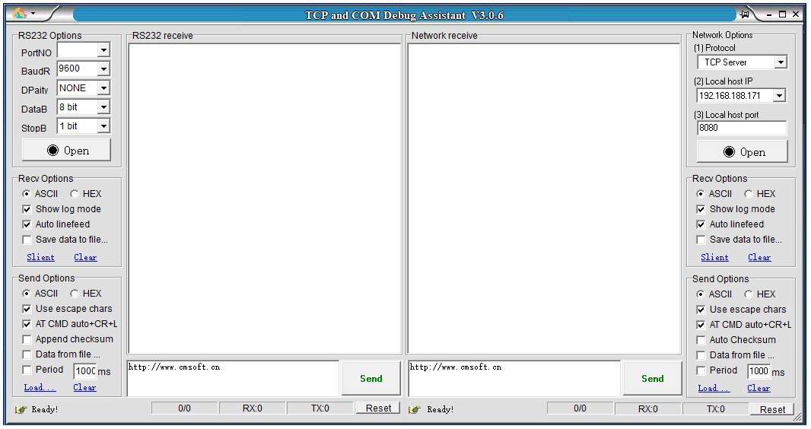

<h2>TCP & COM Debug Assistant</h2>

TCPCOM, ein Zwei-in-Eins-Debugging-Assistent für das Heimnetzwerk und die serielle Schnittstelle, kombiniert den Netzwerk-Debugging-Assistenten und den seriellen Port-Debugging-Assistenten zu einer einfachen und effizienten Software.

<b>Softwarefunktionen</b>
1. Unterstützung von zwei Sprachen Chinesisch und Englisch, automatische Auswahl des Systemsprachentyps entsprechend der Betriebssystemumgebung
2. Unterstützung von ASCII/Hex-Übertragung, die gesendeten und empfangenen Daten können frei zwischen Hexadezimal- und AscII-Codes konvertiert werden, und Unterstützung des Sendens und Anzeigens chinesischer Schriftzeichen
3. Unterstützung des automatischen Hinzufügens von Prüfziffern beim Senden von Daten und Unterstützung mehrerer Prüfformate wie Prüfsumme, XOR, CRC16, feste Bytes usw.
4. Der zu sendende Inhalt unterstützt Escape-Zeichen, wie z as sending Wenn das Feld Escape-Zeichen wie \r\n enthält, wird es automatisch in den entsprechenden ASCII-Code geparst und gesendet.
5. Unterstützt AT-Befehle zum automatischen Hinzufügen von Wagenrücklauf und Zeilenvorschub. Wenn diese Option aktiviert ist, werden beim Senden von AT-Befehlen automatisch ein Wagenrücklauf und ein Zeilenvorschub am Ende der Zeile hinzugefügt.
6. Die empfangenen Daten können automatisch gespeichert werden in eine Datei und unterstützt Datendateien und Protokolle Es gibt zwei Optionen für Dateien:
7. Unterstützungsprotokoll-Empfangsmodus: Beim Empfang von Inhalten werden automatisch relevante Informationen wie der Empfangszeitstempel angezeigt.
8. Das Empfangen und Senden von Text unterstützt die zwei Kodierungsmethoden ANSI und UTF8
9. Unterstützt das Senden in beliebigen Intervallen und das zyklische Senden
10. Daten können zum Senden aus Dateien importiert werden
11. Der Standardinhalt des Sendefelds kann angepasst werden.

<b>Netzwerk-Debugging</b>
1. TCP- und UDP-Protokolle unterstützen, Broadcasting unterstützen, Arbeitsmodus TCP-Server, TCP-Client, UDP; sowohl das Stoppbit als auch das Stoppbit können gesetzt werden
2. Automatische Erkennung der seriellen Portnummer des Geräts