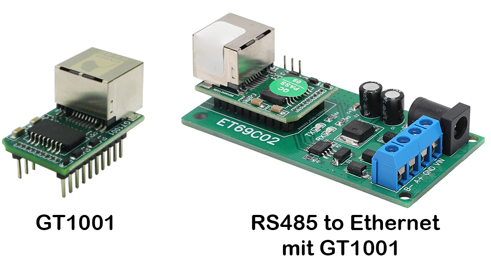
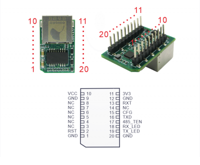
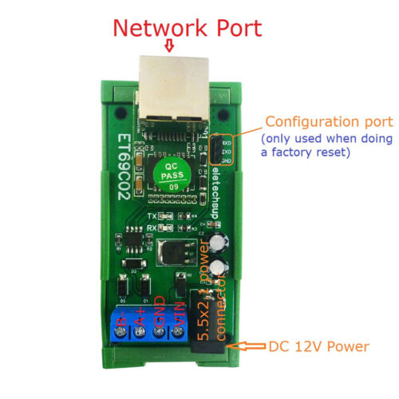
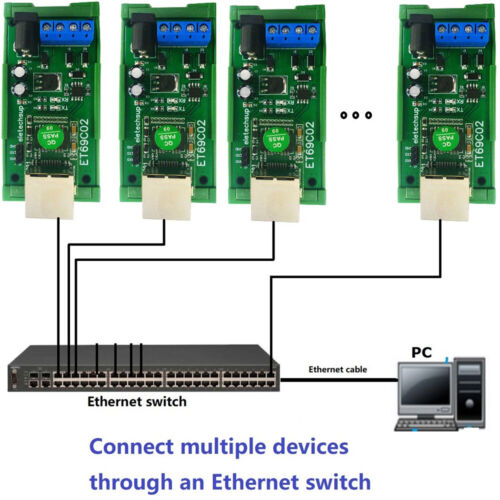

<h2>GT1001</h2>

<b>Industrial Grade - Ethernet-to-Serial (TTL)-Modul</b>

- Mehrere Arbeitsmodi
- Unterstützt die Funktion der virtuellen seriellen Schnittstelle
- Unterstützt die Datenkonvertierung von Modbus TCP und Modbus RTU
- Unterstützung des MQTT-Cloud-Dienstes
- Unterstützt die transparente Übertragung von Netzwerk- und seriellen Daten
- Support-Webseite, AT-Befehlskonfiguration
- Unterstützt Offline-Cache, der maximale Cache beträgt 64 KB
- Geringer Stromverbrauch, geringe Größe, nahtlos passende Leiterplatte

<b>Merkmale</b>
- 10 MBit/s Ethernet-Schnittstelle, automatisches Umschalten der AUTO-MDIX-Netzwerkkabel-Crossover-Direktverbindung
- Der Arbeitsmodus unterstützt TCP Server, TCP Client, UDP, Httpd Client, Modbus Master, Modbus Slave, MQTT
- Die Baudrate des seriellen Anschlusses kann von 600 bps bis 230,4 kbps eingestellt werden und unterstützt fünf Überprüfungsmethoden: Keine, Ungerade, Gerade, Mark und Leerzeichen
- Passen Sie den Heartbeat-Paketmechanismus an, um effektive Verbindungen sicherzustellen und tote Verbindungen zu eliminieren
- Support-Webseite, AT-Befehl, Protokoll für serielle Schnittstelle, Netzwerkprotokoll-Einstellungsparameter, Bereitstellung von Einstellungsprotokollen für Kunden zur Integration in ihre eigene Software
- Unterstützt TCP-Client-Kurzverbindungsfunktion, Anpassung der kurzen Verbindungsunterbrechungszeit
- Unterstützung der Timeout-Neustartfunktion (kein Datenneustart), Anpassung der Neustartzeit
- DHCP-Funktion, kann IP automatisch erhalten
- Der Benutzer kann die MAC-Adresse anpassen
- DNS-Funktion, Domain-Namensauflösung
- Die DNS-Serveradresse kann angepasst werden
- Firmware-Upgrade-Funktion über das Netzwerk, einfach zu aktualisierende Firmware
- Unterstützt die Funktion der virtuellen seriellen Schnittstelle
- Support-Software / Hardware-Wiederherstellung der Werkseinstellungen
- Kann im lokalen Netzwerk arbeiten oder auf ein externes Netzwerk zugreifen
- Unterstützt die Datenkonvertierung von Modbus TCP und Modbus RTU
- Unterstützt die Modbus-Multi-Master-Polling-Funktion
- Unterstützt Offline-Cache, der maximale Cache beträgt 64 KB

<b>Produktparameter</b>
<table>
<tr><td>Betriebsspannung</td>							<td>3,3 V/5,0 V (wahlweise)</td></tr>
<tr><td>Arbeitsstrom	</td>							<td>15 mA bei 3,3 V/5,0 V</td></tr>
<tr><td>Typ des Netzwerkports</td>						<td>RJ45</td></tr>
<tr><td>Serielle Baudrate</td>							<td>600 bps bis 230,4 kbps</td></tr>
<tr><td>Methode prüfen</td>								<td>Keine, Ungerade, Gerade, Mark, Leerzeichen</td></tr>
<tr><td>Serieller Standard</td>							<td>Kompatibel mit TTL-3,3 V/TTL-5,0 V</td></tr>
<tr><td>Netzwerkprotokoll</td>							<td>IP, TCP/UDP, ARP, ICMP, IPV4</td></tr>
<tr><td>IP-Erfassungsmethode</td>						<td>Statische IP, DHCP</td></tr>
<tr><td>DNS	</td>										<td>unterstützt</td></tr>
<tr><td>Benutzer Konfiguration</td>						<td>TCP-Server/TCP-Client/UDP/Modbus/MQTT</td></tr>
<tr><td>HTTP-Client	</td>								<td>unterstützt</td></tr>
<tr><td>Web-Cache	</td>								<td>Senden: 536 Byte; Empfangen: 536 Btye</td></tr>
<tr><td>Empfangspuffer für serielle Schnittstelle</td>	<td>Dualer 1K-Byte-Cache</td></tr>
<tr><td>durchschnittliche Übertragungsverzögerung</td>	<td><10ms</td></tr>
<tr><td>Verpackungsmechanismus</td>						<td>5 Byte Packzeit</td></tr>
<tr><td>Betriebstemperatur</td>							<td>-40 ~85°C</td></tr>
<tr><td>Lagertemperatur</td>							<td>-40 ~105°C</td></tr>
<tr><td>Größe (cm)	</td>								<td>3,2*2,1*2,4 (L*B*H)	3*2 (L*B)</td></tr>
</table>

<b>Pinbelegung</b>

 

<h2>Technische Daten RS485 to Ethernet mit GT1001</h2>
<table>
<tr><td>Betriebsspannung </td><td>DC 12V (DC 6.5-25V)</td></tr>
<tr><td>Arbeitsstrom </td><td>20-25mA</td></tr>
<tr><td>Arbeitsmodus </td><td>UDP, TCP-Client, TCP-Server, Modbus-Slave, Modbus-Master, MQTT</td></tr>
<tr><td>Größe </td><td>72*37*24mm (nur Leiterplatte); 82*41*40mm (mit DIN-Schienengehäuse)</td></tr>
<tr><td>Gewicht </td><td>24g (nur Leiterplatte); 58g (mit DIN-Schienengehäuse)</td></tr>
</table>
TVS Anti-Surge-Schutz

Die Standard-Baudrate ist 9600. Die Baudrate kann über die WEB-Einstellungen ausgewählt werden (1200 2400 4800 9600 19200 38400 57600 115200).

Parität kann keine Parität, gerade Parität und ungerade Parität sein.

 